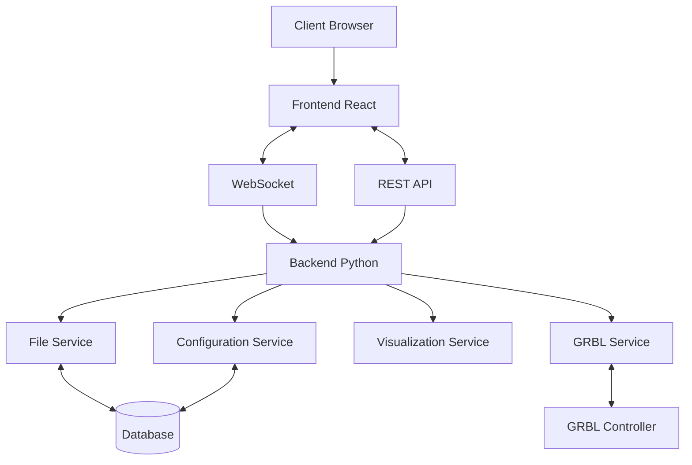
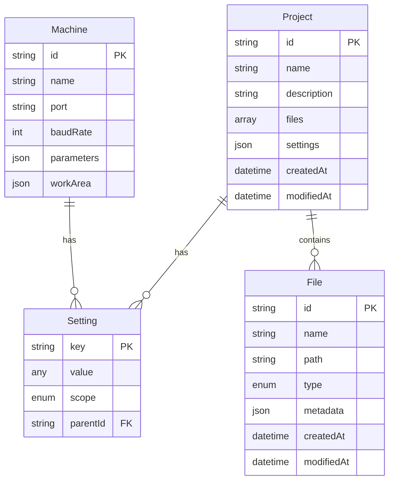

# System Architecture Overview

## Project Information

- **Project Name:** ReactGRBL Controller
- **Version:** 1.0.0
- **Last Updated:** 2023-11-15

## Architecture Overview

ReactGRBL Controller est une application web moderne pour contrôler les machines CNC et graveurs laser utilisant le firmware GRBL. L'architecture est basée sur une approche client-serveur, avec un frontend React JavaScript pour l'interface utilisateur et un backend Python pour la communication avec le matériel. Cette architecture hybride permet de combiner la réactivité et l'expérience utilisateur fluide de React avec la robustesse et la fiabilité de Python pour la communication série.

## System Components

### Frontend

- **Framework:** React.js
- **Key Libraries:**
  - React Router - Pour la navigation
  - Redux/Context API - Pour la gestion d'état
  - Canvas/WebGL - Pour la visualisation de la grille et du G-code
  - Socket.io-client - Pour la communication en temps réel avec le backend
  - Styled Components/Tailwind CSS - Pour le styling

- **State Management:**
  - Redux pour l'état global (état de la machine, paramètres, etc.)
  - Context API pour les états localisés (préférences utilisateur, thèmes, etc.)
  - Local state pour les composants isolés

- **UI Component Structure:**
  - Composants atomiques (boutons, inputs, etc.)
  - Composants de visualisation (grille, prévisualisation G-code)
  - Composants de contrôle (panneau de jogging, contrôles de fichier)
  - Layouts et templates pour l'organisation globale

### Backend

- **Framework:** Flask/FastAPI (Python)
- **API Design:** REST + WebSockets
  - REST pour les opérations CRUD standard
  - WebSockets pour les mises à jour en temps réel et le streaming de données

- **Authentication:** 
  - Authentification basique pour la version initiale
  - JWT pour les versions futures avec multi-utilisateurs

- **Key Services:**
  - Service de communication GRBL - Gère la communication avec le contrôleur GRBL
  - Service de fichiers - Gère l'importation, la conversion et le stockage des fichiers
  - Service de visualisation - Prépare les données pour la visualisation côté client
  - Service de configuration - Gère les paramètres et configurations

### Database

- **Type:** Base de données légère
- **Technology:** SQLite pour la version initiale, avec possibilité de migrer vers PostgreSQL pour les versions futures
- **Data Model:** Voir la section "Modèle de données" ci-dessous
- **Scaling Strategy:** 
  - Mise en cache des requêtes fréquentes
  - Optimisation des requêtes pour les performances
  - Migration vers une base de données plus robuste si nécessaire

## Architecture Diagram

## Key Design Decisions

### Decision 1: Architecture hybride React/Python

- **Context:** Nécessité de combiner une interface utilisateur moderne et réactive avec une communication fiable avec le matériel.
- **Options Considered:**
  - Solution 100% JavaScript (Node.js pour le backend)
  - Solution 100% Python (avec framework web Python)
  - Architecture hybride React/Python
- **Decision:** Architecture hybride avec React pour le frontend et Python pour le backend.
- **Rationale:**
  - React offre une expérience utilisateur supérieure et des outils modernes pour l'UI
  - Python excelle dans la communication série et le traitement de données
  - Cette combinaison permet d'exploiter les forces des deux technologies
- **Consequences:**
  - Nécessite une intégration soignée entre les deux parties
  - Complexité accrue du déploiement
  - Meilleure séparation des préoccupations

### Decision 2: Communication en temps réel via WebSockets

- **Context:** Besoin de mises à jour en temps réel de l'état de la machine et de la position.
- **Options Considered:**
  - Polling régulier via REST API
  - Server-Sent Events (SSE)
  - WebSockets
- **Decision:** Utilisation de WebSockets pour la communication en temps réel.
- **Rationale:**
  - Communication bidirectionnelle permettant des mises à jour instantanées
  - Réduction de la charge réseau par rapport au polling
  - Support large dans les navigateurs modernes
- **Consequences:**
  - Nécessite une gestion des connexions et des reconnexions
  - Complexité accrue du backend
  - Expérience utilisateur améliorée avec des mises à jour en temps réel

### Decision 3: Visualisation basée sur Canvas/WebGL

- **Context:** Besoin d'une visualisation performante de la grille et du G-code.
- **Options Considered:**
  - SVG pour le rendu vectoriel
  - HTML/CSS pour la visualisation
  - Canvas/WebGL pour le rendu
- **Decision:** Utilisation de Canvas/WebGL pour la visualisation.
- **Rationale:**
  - Performances supérieures pour le rendu de nombreux éléments
  - Capacités avancées de transformation (zoom, déplacement)
  - Meilleure gestion des grands fichiers G-code
- **Consequences:**
  - Courbe d'apprentissage plus raide pour le développement
  - Nécessite des optimisations pour les performances
  - Expérience utilisateur plus fluide pour les visualisations complexes

## Communication Patterns

- **Synchronous Communications:**
  - Appels REST API pour les opérations CRUD
  - Requêtes de configuration et de paramètres
  - Chargement et sauvegarde de fichiers

- **Asynchronous Communications:**
  - WebSockets pour les mises à jour d'état en temps réel
  - Notifications d'événements (fin de travail, erreurs, etc.)
  - Streaming de données pendant l'exécution de G-code

- **Error Handling:**
  - Codes d'erreur standardisés entre frontend et backend
  - Journalisation détaillée des erreurs côté serveur
  - Affichage contextuel des erreurs dans l'interface utilisateur
  - Mécanismes de récupération automatique lorsque possible

## Security Architecture

- **Authentication:**
  - Authentification basique pour la version initiale
  - Support pour JWT dans les versions futures
  - Stockage sécurisé des identifiants

- **Authorization:**
  - Contrôle d'accès basé sur les rôles pour les versions multi-utilisateurs
  - Validation des permissions pour les opérations critiques

- **Data Protection:**
  - Chiffrement des données sensibles dans la base de données
  - Communication HTTPS pour les déploiements en production
  - Validation des entrées pour prévenir les injections

- **API Security:**
  - Validation des requêtes
  - Protection contre les attaques CSRF
  - Rate limiting pour prévenir les abus

## Scalability Considerations

- **Horizontal Scaling:**
  - Architecture permettant le déploiement de multiples instances backend
  - Séparation claire des responsabilités pour faciliter la mise à l'échelle

- **Vertical Scaling:**
  - Optimisation des performances pour les ressources limitées
  - Identification des goulots d'étranglement potentiels

- **Caching Strategy:**
  - Mise en cache des configurations et paramètres fréquemment accédés
  - Mise en cache des prévisualisations de G-code

- **Load Balancing:**
  - Support pour le load balancing dans les déploiements multi-instances
  - Gestion des sessions pour assurer la cohérence

## Monitoring and Observability

- **Logging:**
  - Journalisation structurée avec niveaux de détail configurables
  - Rotation des logs pour gérer l'espace disque
  - Journalisation des événements critiques et des erreurs

- **Metrics:**
  - Temps de réponse des API
  - Utilisation des ressources (CPU, mémoire)
  - Statistiques d'utilisation des fonctionnalités

- **Alerting:**
  - Notifications pour les erreurs critiques
  - Alertes pour les problèmes de connexion avec le matériel
  - Surveillance de la santé du système

- **Tracing:**
  - Traçage des requêtes à travers les différentes couches
  - Identification des performances sous-optimales

## Modèle de données

### Entités principales

## Future Considerations

- **Support multi-utilisateurs** avec gestion des permissions et des rôles
- **Intégration avec des services cloud** pour le stockage et le partage de fichiers
- **Applications mobiles natives** pour le contrôle à distance
- **Support pour d'autres firmwares** que GRBL (Marlin, Smoothieware, etc.)
- **Fonctionnalités CAM avancées** intégrées directement dans l'application

---

*Ce document sera mis à jour lorsque des décisions architecturales significatives seront prises ou lorsque l'architecture évoluera.*

## Composants Principaux

L'application ReactGRBL Controller est structurée en deux composants majeurs : le Frontend (interface utilisateur) et le Backend (logique de contrôle et communication).

### 1. Frontend (Client)

Développé en React.js, le frontend est responsable de l'interaction avec l'utilisateur, de la visualisation des données et de la communication des commandes au backend.

*   **Interface Utilisateur (UI) :**
    *   **Composants React :** Ensemble de composants réutilisables pour construire l'interface (ex: boutons, sliders, panneaux d'information, grille de visualisation).
    *   **Gestion de l'état :** Utilisation de Redux ou de l'API Context de React pour gérer l'état global de l'application (ex: état de la connexion, paramètres machine, données du fichier chargé, position actuelle).
    *   **Visualisation :**
        *   **Grille de Travail :** Composant Canvas/WebGL pour afficher la zone de travail, la position de l'outil, les tracés G-code, et les images importées. Doit permettre le zoom, le déplacement (pan), et l'affichage de coordonnées (PRD 4.2.1). Origine (0,0) en haut à droite.
        *   **Prévisualisation G-code :** Affichage du parcours de l'outil avant l'exécution (PRD 4.2.3).
    *   **Manipulation d'objets :** Déplacement, rotation, mise à l'échelle des images/vecteurs sur la grille (PRD 4.2.2).
*   **Services :**
    *   **Service API Client :** Module pour envoyer des requêtes HTTP (REST) au backend et gérer les réponses.
    *   **Service WebSocket Client :** Module pour établir et maintenir une connexion WebSocket avec le backend pour la communication en temps réel (ex: statut de la machine, logs GRBL).
    *   **Service de Fichiers :** Gestion de l'importation de fichiers G-code et images (SVG, DXF, PNG, JPG) (PRD 4.3.1), et potentiellement la sauvegarde de configurations de projet.

### 2. Backend (Serveur)

Développé en Python avec FastAPI (ou Flask), le backend gère la logique métier, la communication avec le contrôleur GRBL, et sert de pont entre le frontend et la machine.

*   **API Endpoints (REST & WebSockets) :**
    *   **REST API :** Points d'accès pour les opérations CRUD sur les fichiers, les paramètres, la gestion de projet, et les commandes qui ne nécessitent pas de temps réel strict.
        *   Exemples : `/connect`, `/disconnect`, `/upload_file`, `/settings`, `/jog`.
    *   **WebSockets :** Canal pour la communication bidirectionnelle en temps réel.
        *   Exemples : envoi du statut GRBL, des logs, réception des commandes de streaming G-code.
*   **Modules de Service :**
    *   **Contrôleur GRBL (`grbl_controller.py`) :**
        *   Gestion de la connexion série (PySerial) avec la carte GRBL (PRD 4.1.1).
        *   Envoi de commandes G-code et parsing des réponses de GRBL.
        *   Streaming de G-code (PRD 4.4.2).
        *   Gestion des commandes de jogging (PRD 4.4.1).
        *   Surveillance de l'état de la machine.
    *   **Service de Fichiers (`file_service.py`) :**
        *   Gestion du stockage et de la récupération des fichiers G-code et des projets.
        *   **Conversion Image vers G-code :** Module pour convertir les formats d'image supportés en G-code (PRD 4.3.2).
    *   **Service de Configuration/Paramètres :** Gestion des paramètres de la machine et de l'application.
*   **Persistance des Données :**
    *   Utilisation de SQLite ou TinyDB pour stocker les configurations, les informations sur les projets, et potentiellement une bibliothèque de G-code (PRD 5.5).

### 3. Communication Inter-Composants

*   **Frontend vers Backend :**
    *   Requêtes HTTP (via l'API REST) pour les actions telles que la connexion, le chargement de fichiers, la modification des paramètres.
    *   Messages WebSocket pour les commandes en temps réel (jogging, démarrage/arrêt de tâches, envoi de commandes G-code spécifiques).
*   **Backend vers Frontend :**
    *   Réponses HTTP aux requêtes REST.
    *   Messages WebSocket pour diffuser l'état de la machine, les logs, les mises à jour de progression, les alertes.
*   **Backend vers Contrôleur GRBL :**
    *   Communication série via PySerial pour envoyer des commandes G-code et recevoir le statut.

- **Error Handling:**
  - Codes d'erreur standardisés entre frontend et backend
  - Journalisation détaillée des erreurs côté serveur
  - Affichage contextuel des erreurs dans l'interface utilisateur
  - Mécanismes de récupération automatique lorsque possible

## Security Architecture

- **Authentication:**
  - Authentification basique pour la version initiale
  - Support pour JWT dans les versions futures
  - Stockage sécurisé des identifiants

- **Authorization:**
  - Contrôle d'accès basé sur les rôles pour les versions multi-utilisateurs
  - Validation des permissions pour les opérations critiques

- **Data Protection:**
  - Chiffrement des données sensibles dans la base de données
  - Communication HTTPS pour les déploiements en production
  - Validation des entrées pour prévenir les injections

- **API Security:**
  - Validation des requêtes
  - Protection contre les attaques CSRF
  - Rate limiting pour prévenir les abus

## Scalability Considerations

- **Horizontal Scaling:**
  - Architecture permettant le déploiement de multiples instances backend
  - Séparation claire des responsabilités pour faciliter la mise à l'échelle

- **Vertical Scaling:**
  - Optimisation des performances pour les ressources limitées
  - Identification des goulots d'étranglement potentiels

- **Caching Strategy:**
  - Mise en cache des configurations et paramètres fréquemment accédés
  - Mise en cache des prévisualisations de G-code

- **Load Balancing:**
  - Support pour le load balancing dans les déploiements multi-instances
  - Gestion des sessions pour assurer la cohérence

## Monitoring and Observability

- **Logging:**
  - Journalisation structurée avec niveaux de détail configurables
  - Rotation des logs pour gérer l'espace disque
  - Journalisation des événements critiques et des erreurs

- **Metrics:**
  - Temps de réponse des API
  - Utilisation des ressources (CPU, mémoire)
  - Statistiques d'utilisation des fonctionnalités

- **Alerting:**
  - Notifications pour les erreurs critiques
  - Alertes pour les problèmes de connexion avec le matériel
  - Surveillance de la santé du système

- **Tracing:**
  - Traçage des requêtes à travers les différentes couches
  - Identification des performances sous-optimales

## Modèle de données

### Entités principales

## Future Considerations

- **Support multi-utilisateurs** avec gestion des permissions et des rôles
- **Intégration avec des services cloud** pour le stockage et le partage de fichiers
- **Applications mobiles natives** pour le contrôle à distance
- **Support pour d'autres firmwares** que GRBL (Marlin, Smoothieware, etc.)
- **Fonctionnalités CAM avancées** intégrées directement dans l'application

---

*Ce document sera mis à jour lorsque des décisions architecturales significatives seront prises ou lorsque l'architecture évoluera.*
